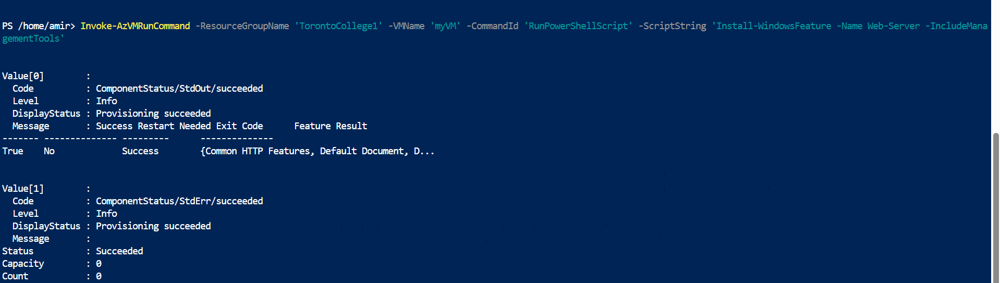

#  🥇Démarrage rapide : créer une machine virtuelle Windows dans Azure avec PowerShell
------------------------------------------------------------------------------------
Le module Azure PowerShell permet de créer et de gérer des ressources Azure depuis la ligne de commande PowerShell ou des scripts. Ce guide de démarrage rapide explique comment utiliser le module Azure PowerShell pour déployer une machine virtuelle (VM) dans Azure exécutant Windows Server 2016. Vous y installerez également le portail Bureau à distance (RDP) et le serveur web IIS pour visualiser la VM en action.

🀄Lancer Azure Cloud Shell
---------------------------
vous pouvez changez le Name 'myRsourceGroup' a votre choix 
```
New-AzResourceGroup -Name 'myResourceGroup' -Location 'eastus'
```


📶 Créer une machine virtuelle
------------------------------

Créez une machine virtuelle avec New-AzVM . Indiquez le nom de chaque ressource et New-AzVMcréez-la avec l'applet de commande si elles n'existent pas déjà.

Lorsque vous y êtes invité, indiquez un nom d'utilisateur et un mot de passe à utiliser comme informations de connexion pour la machine virtuelle :

```
New-AzVm -ResourceGroupName 'TorontoCollege1' -Name 'server2022' -Location 'eastus' -Image 'MicrosoftWindowsServer:WindowsServer:2022-datacenter-azure-edition:latest' -VirtualNetworkName 'myVnet' -SubnetName 'mySubnet' -SecurityGroupName 'myNetworkSecurityGroup' -PublicIpAddressName 'myPublicIpAddress' -OpenPorts 80,3389
```


🫀Installer le serveur Web
---------------------------


```
Invoke-AzVMRunCommand -ResourceGroupName 'TorontoCollege1' -VMName 'myVM' -CommandId 'RunPowerShellScript' -ScriptString 'Install-WindowsFeature -Name Web-Server -IncludeManagementTools'
```


😧 Verification de la machine VM
=

