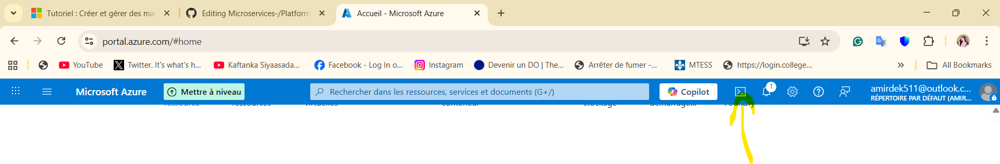

# Tutoriel : Créer et gérer des machines virtuelles Windows avec Azure PowerShell
Les machines virtuelles Azure offrent un environnement informatique entièrement configurable et flexible. Ce tutoriel aborde les tâches de base du déploiement d'une machine virtuelle Azure, comme la sélection de la taille et de l'image de la machine virtuelle, ainsi que son déploiement. Vous apprendrez à :

🃏Créer et se connecter à une VM

🪕Sélectionner et utiliser des images de machines virtuelles

⚓Afficher et utiliser des tailles de machines virtuelles spécifiques

🎱Redimensionner une VM

😠Afficher et comprendre l'état de la machine virtuelle

:one: Lancer Azure Cloud Shell
-----------------------------

