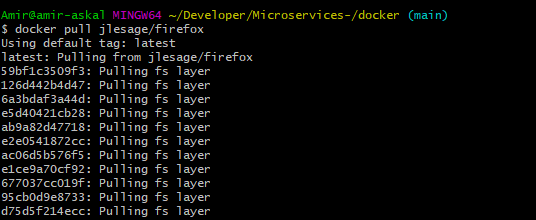
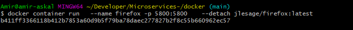

# 📖  Creer un application browser l'interieur docker FIREFOX 
-------------------------------------------------------

## 💥: Pour le but de ce tutorial est ouvrir le browser firefox dans docker container 
intro 
Demarrage rapide 


constament a notre ordinateur est sature a cause de telecharger des plusieurs applicactions parfois l'ordinateur se ralentir.
a l'aide de technologie on'a trouve la solution de reduire tout ca.

a l'apparition de docker les machines se sens moin sature et que les utilisateurs s'oriente vers la virtualisation. voyons voir l'utilite de phenomene docker 

🥁 premeire etape : telecharger de l'image  firefox dans dockerhub 
--------------------------------------------------------------------

```
$ docker pull jlesage/firefox
```



🧑‍⚖ deuxieme etape creer le container du browser firefox 
-----------------------------------------------------

```
$ docker container run --name firefox -publish 5800:5800 --detach jlesage/firefox 
```
◾ docker container c'est la ou que l'image s'installe firefox 
◾ name firefox permet identifier le nom du container  
◾ publish 5800:5800 c'est le chemin d'acces du navigateur 

