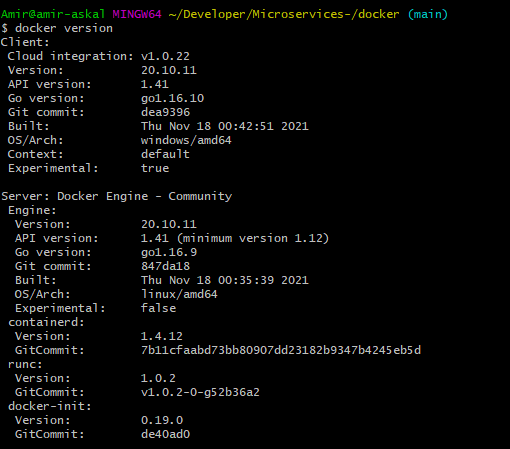
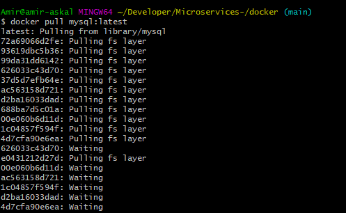
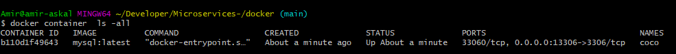
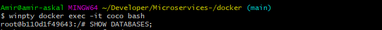
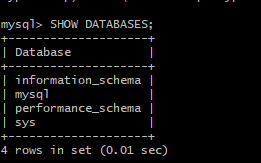

# 🔖 Comment Configurer Et Utiliser Le Conteneur MySQL DOCKER

🟤 Ce tutoriel explique la methode etape par etape pour configuerer et utliser le conteneur MYSQL docker localement avec exemeple : 
--------------------------------------------------------------------------------------------------------------------------
◾ Prerequis : Installer Docker 
------------------------------
❗ Je vous conseil d'utuliser gitbash pour executer les commandes 

cliquer ce lien https://docs.docker.com/desktop/windows/install/

0️⃣ Pour valider l'installation de docker , executez simplement la commande ci-dessous : 
----------------------------------------------------------------------------------------

1️⃣ Telecharger la dernier version de l'image MYSQL disponnible 
----------------------------------------------------------------

2️⃣ Demarrez le conteneur avec l'image telechargee 
---------------------------------------------------

3️⃣ Verifions si le conteneur a ete cree avec succes 
---------------------------------------------------

4️⃣ Connectez-vous au conteneur cree 
-----------------------------------

5️⃣ Demarrez le shell MYSQL 
---------------------------

6️⃣  Afficher les bases de  donnees 
----------------------------------

