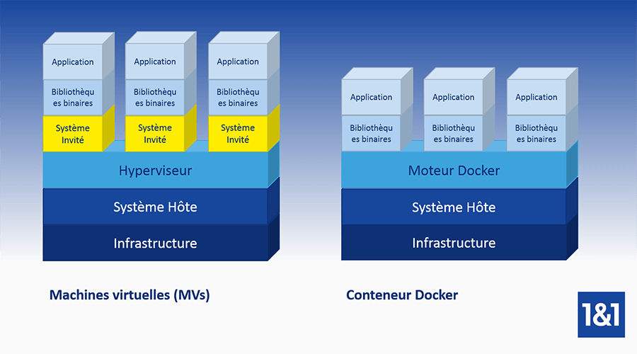

# 🐳 Docker 

Docker est une plateforme logicielle open source permettant de creer, de deployer et gerer des containers d'application virtualisees  sur un systeme d'exploitation.

## 💘Fonctionnalites 

💧: La plateforme de conteneurisation repose sur sept composants principaux.
Le Docker Engine est un outil client-serveur sur lequel repose la technologie de container pour prendre en charge les tâches de création d’applications basées container.

